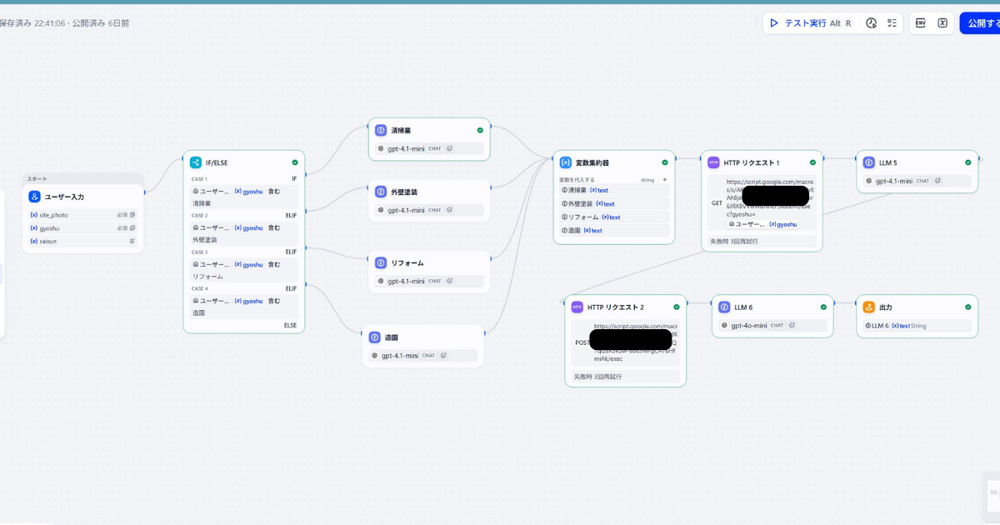
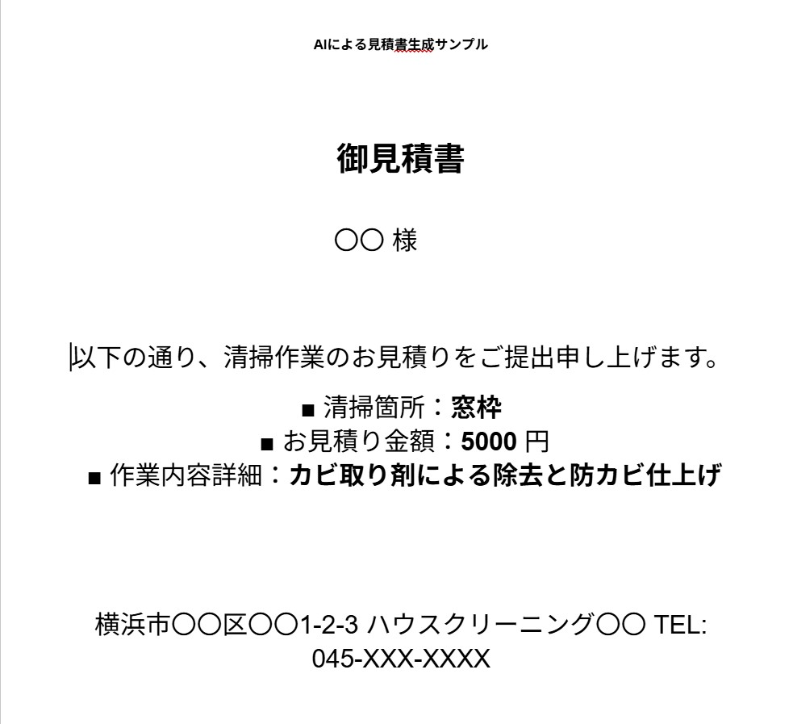

# AI見積書自動作成システム

Dify・Google Apps Script（GAS）・Google Sheetsを連携し、  
現場写真をもとにした見積書作成業務を効率化するAI業務自動化システムです。

## 概要

現場写真をDifyでAI分析し、見積作成に必要な情報を整理します。

その後、Google Sheetsで管理している単価情報を参照し、見積データを作成します。

最後に、見積書テンプレートへデータを反映し、PDFとして出力・保存します。

現場で撮影した写真から、見積書作成までの一連の作業を自動化することを目的としています。

---

## システム構成

### 1. Dify

現場写真をAIで分析し、見積作成に必要な情報を整理します。

主な処理内容：

- 現場写真の分析
- 作業内容の整理
- 必要な作業項目の抽出
- 数量などの見積情報の整理

---

### 2. 単価管理Google Sheets ＋ GAS①

Google Sheetsで作業内容と単価を管理しています。

例：

| 作業内容 | 単価 | 単位 |
|---|---:|---|
| 床清掃 | 500円 | ㎡ |
| 窓清掃 | 800円 | 枚 |
| トイレ清掃 | 3,000円 | 箇所 |
| エアコン清掃 | 8,000円 | 台 |

GAS①では、Difyから整理された見積項目をもとに、Google Sheetsから該当する単価情報を取得します。

---

### 3. 見積書テンプレート ＋ GAS②

取得した作業内容・数量・単価などの情報を、あらかじめ用意した見積書テンプレートへ反映します。

その後、GAS②によって見積書をPDFとして生成します。

---

### 4. PDF保存

生成された見積書PDFは、Google Driveの指定フォルダへ保存します。

これにより、見積書の作成からファイル保存までを自動化しています。

---

## 処理の流れ

```text
現場写真
   ↓
Dify
   ↓
AIによる写真分析
   ↓
見積項目・数量などを整理
   ↓
GAS①
   ↓
単価管理Google Sheetsを参照
   ↓
単価情報を取得
   ↓
見積データ作成
   ↓
GAS②
   ↓
見積書テンプレートへ反映
   ↓
PDF生成
   ↓
Google Driveへ保存
```

## Difyワークフロー

Difyを中心に、現場写真の分析から見積情報の整理、
外部処理との連携までをワークフロー化しています。



---
## 担当・構築内容

このシステムでは、以下の設計・構築を行いました。

### 1. Difyワークフローの設計・構築

現場写真を入力として、作業内容に応じて処理を分岐するワークフローを構築しました。

IF/ELSEを使用して、以下の作業種別に応じたAI処理を行います。

- 清掃業
- 外壁塗装
- リフォーム
- 造園

それぞれの処理結果を後続処理で利用できるように、変数を整理・集約しています。

### 2. Google Sheetsとの連携

作業内容・単価・単位をGoogle Sheetsで管理し、見積作成時に必要な単価情報を取得できる仕組みを構築しました。

単価をコードに直接書き込むのではなく、Google Sheetsで管理することで、単価変更にも対応しやすい構成にしています。

### 3. Google Apps Script（GAS）との連携

Difyから整理された見積情報をGASへ渡し、Google Sheetsの単価情報を利用して見積データを作成する処理を構築しました。

さらに、見積書テンプレートへデータを反映し、PDFとして出力する処理もGASで構築しています。

### 4. 見積書PDFの自動生成・保存

作成した見積データを見積書テンプレートへ反映し、PDFを生成します。

生成されたPDFはGoogle Driveの指定フォルダへ保存されるようにしています。

---

### 構築した処理の全体像

```text
Dify
  ↓
現場写真のAI分析
  ↓
作業種別による処理分岐
  ↓
見積項目・数量の整理
  ↓
Google Sheetsから単価取得
  ↓
見積データ作成
  ↓
見積書テンプレートへ反映
  ↓
PDF生成
  ↓
Google Driveへ保存
---

## 出力例

AIによる現場情報の整理と自動処理によって、以下のような見積書PDFを生成します。

### AIによる見積書生成サンプル



[見積書画像を開く](images/estimate-output.jpg)

## 工夫した点

### 1. 単価情報をGoogle Sheetsで管理

作業単価をGASのコード内に直接記述するのではなく、Google Sheetsで管理する構成にしました。

これにより、単価を変更する場合でもコードを修正せず、Google Sheetsの内容を変更するだけで対応できるようにしています。

### 2. 作業種別によるAI処理の分岐

現場写真から取得した情報を、IF/ELSEによって作業種別ごとに分岐させています。

清掃業、外壁塗装、リフォーム、造園など、それぞれの業務内容に応じたAI処理を行う構成にしています。

### 3. AIだけで完結させない構成

AIによる判断だけに依存せず、単価情報はGoogle Sheets、帳票作成とPDF生成はGASというように、それぞれの処理に適した仕組みを組み合わせています。

AIが得意な「写真からの情報整理」と、ルールに基づいて処理する「単価取得・帳票作成」を分けることで、業務処理全体を安定させることを意識しました。

### 4. 見積書作成までを一連の流れにする

写真を分析するだけで終わらせず、

「写真 → 情報整理 → 単価取得 → 見積データ作成 → PDF生成 → 保存」

までを一連の処理として構築しました。

単体のAIツールではなく、実際の業務で利用することを想定した業務フローとして設計しています。
## 今後の改善

現在のシステムをさらに実用的なものにするため、以下の改善を検討しています。

### 1. AIの認識精度の向上

現場写真から作業内容や数量を判断する際、写真だけでは判断できないケースがあります。

今後は、写真に加えて現場からのメモや補足情報も組み合わせることで、見積情報の精度を高めていきます。

### 2. AIの判断内容を確認できる仕組み

AIが判断した作業内容や数量を、そのまま見積書に反映するのではなく、人が確認してから確定できる仕組みを検討しています。

AIによる自動化と、人による最終確認を組み合わせることで、誤った情報がそのまま見積書になることを防ぎます。

### 3. エラー発生時の処理

外部サービスとの通信エラーやデータ取得エラーが発生した場合でも、原因を確認しやすいように、エラー処理やログ管理を改善していきます。

### 4. 対応できる業務の拡張

現在の仕組みをベースに、清掃業だけでなく、外壁塗装・リフォーム・造園など、異なる業務にも対応できる仕組みへ発展させていく予定です。
---

## 使用技術

- Dify
- Google Apps Script（GAS）
- Google Sheets
- Google Drive
- PDF

---

## このシステムで実現していること

このシステムでは、以下の作業を一連の流れとして自動化しています。

- 現場写真のAI分析
- 見積項目の整理
- 数量情報の整理
- 単価情報の取得
- 見積データの作成
- 見積書テンプレートへの反映
- PDF生成
- Google Driveへの保存

---

## 制作背景

清掃業務では、現場作業だけでなく、見積書作成などの事務作業にも時間がかかります。

そこで、AIとノーコード・ローコードツールを組み合わせることで、

**「現場で撮影した写真」から「見積書PDFの作成」までを効率化できないか**

という考えから、このシステムを制作しました。

プログラミング経験がない状態から、Dify・GAS・Google Sheetsなどを組み合わせて構築しています。

---

## ポートフォリオとしての目的

このプロジェクトでは、単にAIを使うだけではなく、

**AI × 業務データ × 自動処理**

を組み合わせた業務改善の仕組みを構築することを目的としています。

今後も、実際の業務で発生する定型作業をAIと自動化ツールによって効率化する仕組みを制作していきます。
